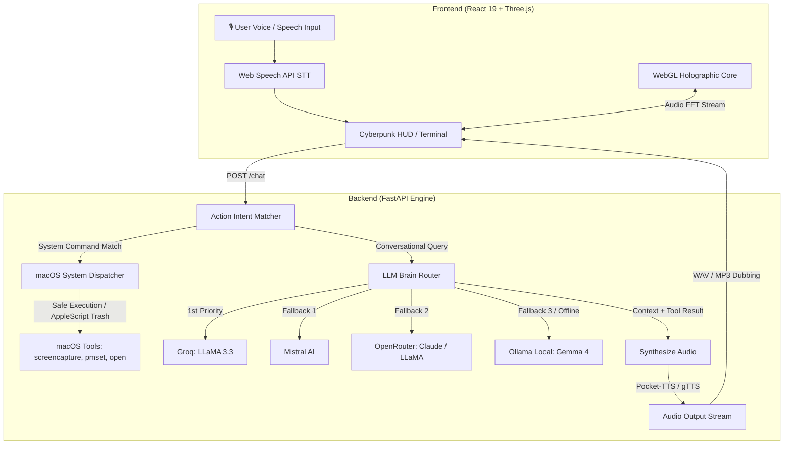

<div align="center">

  

  <br/><br/>

  <h1>Project J.A.R.V.I.S.</h1>

  <p>
    <strong>Just A Rather Very Intelligent System</strong><br/>
    <em>A futuristic, sci-fi desktop AI assistant powered by a holographic React + Three.js interface and a high-performance FastAPI brain.</em>
  </p>

  <p>
    <a href="https://github.com/satiricalguru/Jarvis/stargazers"></a>
    
    
    
    
    
  </p>

  <p>
    <a href="#-quick-start"><b>Quick Start</b></a> •
    <a href="#-features"><b>Features</b></a> •
    <a href="#-architecture"><b>Architecture</b></a> •
    <a href="#-voice-cloning"><b>Voice Cloning</b></a> •
    <a href="#-supported-commands"><b>Supported Commands</b></a> •
    <a href="#-configuration"><b>Configuration</b></a>
  </p>

  <blockquote>
    🌟 <strong>Enjoying Project J.A.R.V.I.S.? If this project inspired you, please drop a star ⭐ to support further development!</strong>
  </blockquote>

</div>

---

<div align="center">
  <h3>🖥️ Holographic Interface Preview</h3>
  
</div>

---

## ⚡ Overview

**Project J.A.R.V.I.S.** is a hands-free, voice-first intelligent desktop companion inspired by Tony Stark’s iconic AI. Built specifically for macOS, it integrates live speech recognition, multi-tiered LLM routing, realistic zero-shot voice synthesis, and real OS-level system automation into a responsive WebGL HUD.

### ✨ Highlights

- 🎙 **Voice-First Interaction**: Push-to-talk, click toggle, or hands-free continuous conversation with automatic echo mitigation.
- 🔮 **Holographic Three.js Visualizer**: Real-time microphone audio reactivity, animated FFT telemetry bars, and interactive particle field.
- 🧠 **Multi-LLM Fallback Chain**: High-speed routing across Groq, Mistral, OpenRouter, and 100% local Ollama inference.
- 🗣 **Zero-Shot Voice Cloning**: Bundled Kyutai Pocket-TTS engine duplicates any target voice using a brief 5-second reference sample.
- ⚙️ **Native macOS Control**: Launch applications, capture screens, query battery & memory telemetry, and safely manage files.
- 🛡️ **Safety Guardrails**: Trash-first file safety, path containment, question filtering, and remote-execution security locks.

---

## 🏗️ Architecture



---

## 🚀 Quick Start

Get J.A.R.V.I.S. running in **less than 2 minutes** with the automated launcher:

```bash
# 1. Clone the repository
git clone https://github.com/satiricalguru/Jarvis.git
cd Jarvis

# 2. Launch with the one-command runner
chmod +x start.sh
./start.sh
```

`start.sh` handles everything automatically:
- Creates a Python `.venv` and installs all backend dependencies if missing.
- Sets up `backend/.env` from `.env.example`.
- Installs frontend `node_modules` if needed.
- Starts FastAPI on `http://localhost:8000` and Vite on `http://localhost:5173`.
- Handles clean shutdown of both processes on exit (`Ctrl+C`).

Once running, open **[http://localhost:5173](http://localhost:5173)** in your browser.

---

## 🛠️ Manual Installation

If you prefer to configure and run the backend and frontend separately:

### 1. Backend Setup

```bash
cd backend

# Create virtual environment
python3 -m venv .venv
source .venv/bin/activate

# Install requirements
pip install -r requirements.txt

# Configure environment keys
cp .env.example .env

# Run FastAPI backend
uvicorn app.main:app --reload --port 8000
```

### 2. Frontend Setup

```bash
cd frontend

# Install dependencies
npm install

# Start Vite development server
npm run dev
```

Visit **`http://localhost:5173`** to access the HUD interface.

---

## 🎙️ Voice Cloning (Pocket-TTS)

J.A.R.V.I.S. features native zero-shot voice cloning using Kyutai’s ultra-fast **Pocket-TTS** engine:

1. **Reference Audio**: A high-fidelity reference voice sample is bundled at `backend/assets/jarvis.wav`. You can replace it with any 5-10 second clear `.wav` recording at `backend/voices/jarvis.wav`.
2. **Hugging Face Token** *(Optional)*: Add your token to `backend/.env` to download premium gated voice weights:
   ```env
   HUGGINGFACE_TOKEN=hf_your_token_here
   ```
3. **Automatic Fallback**: If Pocket-TTS is initializing or unconfigured, the system automatically falls back to lightweight Google TTS (`gTTS`) with zero interruption.

---

## 💻 Supported Commands

J.A.R.V.I.S. includes built-in semantic intent recognition for native macOS control:

| Category | Voice / Text Command | Executed macOS Action |
|---|---|---|
| 📸 **Screenshots** | *"Take a screenshot"*, *"Capture screen"* | Saves timestamped PNG to Desktop via `screencapture` |
| 🚀 **App Launcher** | *"Open Spotify"*, *"Launch Safari"*, *"Start Terminal"* | Launches target application via macOS `open -a` |
| 🌐 **Browsing** | *"Open github.com"*, *"Search google.com for AI"* | Opens URL in your default browser |
| 🔋 **Battery Info** | *"Battery status"*, *"What's my power level?"* | Queries `pmset -g batt` with percentage and charging state |
| 💾 **System Telemetry** | *"System info"*, *"Check RAM and storage usage"* | Fetches macOS memory, CPU load, and disk utilization |
| 📁 **File Creator** | *"Create file notes.txt with hello world"* | Safely writes file inside designated user directories |
| 🗑️ **Trash Safety** | *"Delete file notes.txt"* | **Non-destructive**: Moves file to macOS Trash via AppleScript |
| 📷 **Camera** | *"Open camera"*, *"Open photo booth"* | Launches Photo Booth for instant video preview |

> 🛡️ **Safety Protection**: Deletions never use destructive `rm -rf`. All file removal requests are validated against directory boundary limits (blocking root `/`, system folders, and codebase directories) and sent to the macOS Trash (`~/.Trash`) so they can be restored at any time.

---

## ⚙️ Configuration

Configure your AI providers in `backend/.env` or in the frontend **Settings (⚙️) → API Keys** modal:

```env
# --- LLM Providers ---
GROQ_API_KEY=your_groq_key_here
GROQ_MODEL=llama-3.3-70b-versatile

MISTRAL_API_KEY=your_mistral_key_here
MISTRAL_MODEL=mistral-small-latest

OPENROUTER_API_KEY=your_openrouter_key_here
OPENROUTER_MODEL=meta-llama/llama-3.3-70b-instruct:free

# --- Local Offline LLM (Ollama) ---
OLLAMA_MODEL=gemma4:e4b
OLLAMA_SECOND_MODEL=gemma4:e2b

# --- Voice Engine ---
HUGGINGFACE_TOKEN=your_huggingface_token
HF_TTS_MODEL=kyutai/pocket-tts

# --- Security & Remote Access ---
TELEGRAM_BOT_TOKEN=your_bot_token_here
TELEGRAM_SECRET_TOKEN=your_webhook_secret_token
ALLOW_REMOTE_SYSTEM_ACTIONS=false
```

---

## ⌨️ Controls & Shortcuts

| Action | Control |
|---|---|
| **Push-to-Talk** | Hold <kbd>Space</kbd> while on the main HUD |
| **Continuous Listening** | Click the microphone icon in the header or toggle in Settings |
| **Terminal Drawer** | Click **Logs** in the header or drag the bottom terminal bar |
| **Provider Telemetry** | Click on the provider status badges in the upper right |
| **Settings Panel** | Click the gear icon <kbd>⚙️</kbd> in the top navigation |

---

## 📂 Project Structure

```
Jarvis/
├── assets/                  # High-resolution logos, banners, and media
│   ├── jarvis-banner.png    # Cinematic HUD header banner
│   └── jarvis-logo.png      # Circular Stark Industries AI emblem
├── backend/
│   ├── app/
│   │   ├── main.py          # FastAPI application, audio cache, CORS
│   │   ├── brain.py         # Multi-provider LLM orchestrator & health
│   │   ├── tools.py         # Sandboxed macOS system action dispatcher
│   │   ├── tts.py           # Audio synthesis thread dispatcher
│   │   ├── voice_engine.py  # Pocket-TTS zero-shot voice cloning engine
│   │   ├── telegram_bot.py  # Authenticated Telegram webhook handler
│   │   └── models.py        # Pydantic schemas for chat & telemetry
│   ├── assets/              # Default reference voices (jarvis.wav)
│   ├── .env.example         # Environment template
│   └── requirements.txt     # Python dependency manifest
├── frontend/
│   ├── src/
│   │   ├── components/      # MicBlobScene, SettingsModal, TerminalLog
│   │   ├── hooks/           # useSpeechToText, useDubbedAudio
│   │   ├── App.tsx          # Main HUD shell and event orchestration
│   │   └── config.ts        # API configuration
│   └── package.json         # React 19 + Three.js frontend manifest
└── start.sh                 # Intelligent one-command development launcher
```

---

## 🔒 Security & Privacy

- **Safe API Storage**: API keys entered in the frontend remain in your browser's encrypted local state and are transmitted only as bearer headers to your local FastAPI backend.
- **No Insecure Remote Execution**: The Telegram bot endpoint enforces `X-Telegram-Bot-Api-Secret-Token` validation and disables remote system execution by default unless `ALLOW_REMOTE_SYSTEM_ACTIONS=true` is deliberately enabled.
- **Sanitized Deletions**: Deletion commands strictly reject root directories, system files, and project paths. Files are routed to macOS Trash rather than unrecoverable permanent deletion.

---

## 🤝 Contributing

Contributions, bug reports, and feature suggestions are welcome!

1. Fork the repository
2. Create your feature branch (`git checkout -b feature/amazing-feature`)
3. Commit your changes (`git commit -m 'Add amazing feature'`)
4. Push to the branch (`git push origin feature/amazing-feature`)
5. Open a Pull Request

---

## 📄 License

This project is licensed under the **MIT License** — see the [LICENSE](LICENSE) file for details.

<div align="center">
  <sub>Built with ❤️ for AI enthusiasts and Iron Man fans. Inspired by J.A.R.V.I.S.</sub>
</div>
